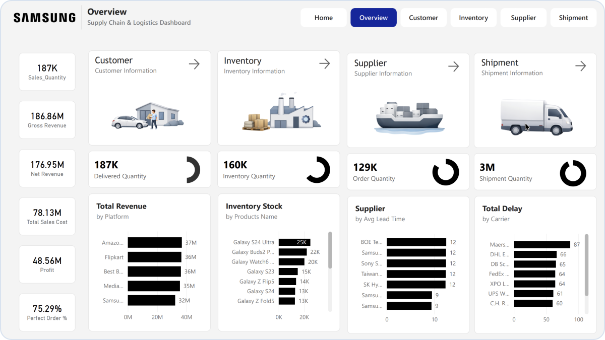
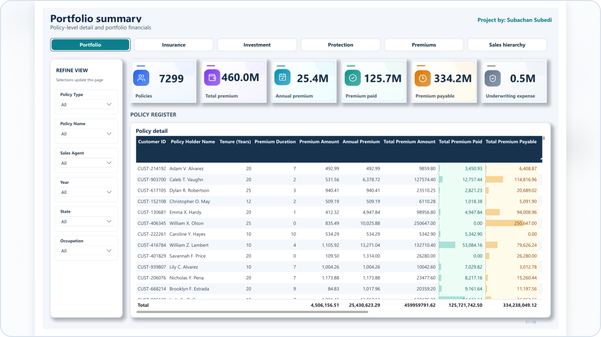
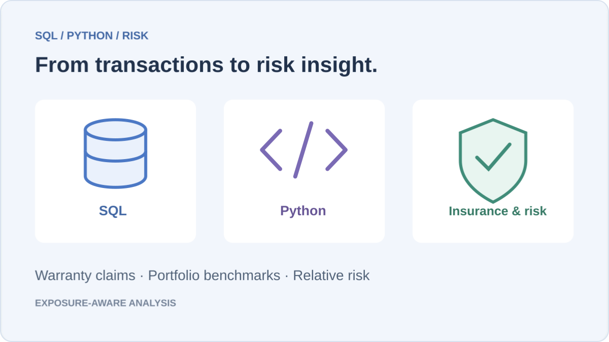
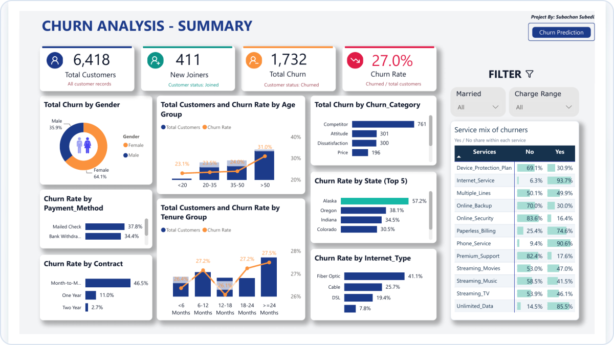
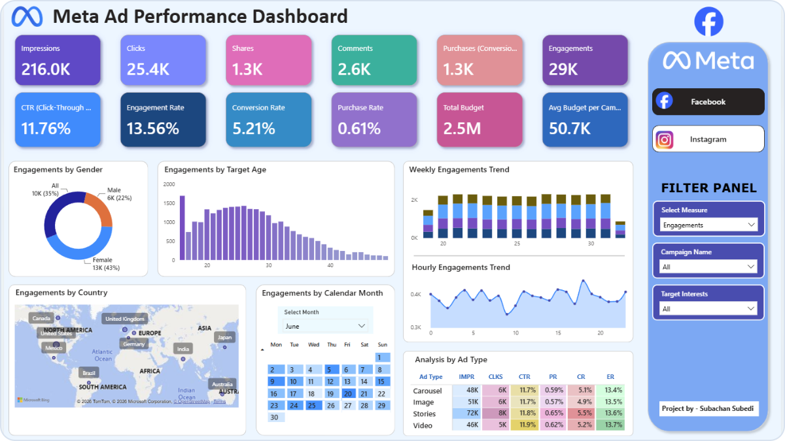

# Subachan Subedi 👋

**Data Analysis • Financial Analysis • Actuarial Risk Analysis**  
Computer Science @ USF | Actuarial Science Minor

**Seeking Data Analyst / Financial Analyst / Actuarial Analyst Internships**

[Email](mailto:subachansubedi@gmail.com) &nbsp; / &nbsp; [LinkedIn](https://www.linkedin.com/in/subachan-subedi-624641331/) &nbsp; / &nbsp; [Projects](#selected-projects) &nbsp; / &nbsp; [About](#about) &nbsp; / &nbsp; [Toolkit](#toolkit)

I use SQL, Python, Power BI, and Excel to turn data into insights on business performance, financial outcomes, and insurance risk. My work combines data validation, analytical reporting, and financial models to support clear, evidence-based decisions.

## Selected projects

Seven case studies demonstrating data analysis, financial decision support, and actuarial methods—from profitability and lending portfolios to claim costs and illustrative premium modeling. Open a preview for the dashboard or report; follow the links for the implementation.

<table>
<tr>
<td width="50%" valign="top">
  
📦 &nbsp; 01 · OPERATIONS &amp; FINANCIAL ANALYTICS

  <h3><a href="https://github.com/subachansubedi/Supply-Chain-And-Logistics-Analytics">Supply Chain &amp; Logistics</a></h3>
  
  
<strong>10 tables · 6 report pages</strong>

  
Revenue, profit margin, procurement spend, and inventory analysis across a synthetic supply chain, with six Power BI report pages and independent SQL KPI reconciliation.

  
 &nbsp;  &nbsp; 

  
<a href="https://github.com/subachansubedi/Supply-Chain-And-Logistics-Analytics"><strong>Case study ↗</strong></a> &nbsp; · &nbsp; <a href="https://github.com/subachansubedi/Supply-Chain-And-Logistics-Analytics/blob/main/Dashboard%20Pdf/Dashboard.pdf">Dashboard</a> &nbsp; · &nbsp; <a href="https://github.com/subachansubedi/Supply-Chain-And-Logistics-Analytics/blob/main/Sql%20File/validation_queries.sql">SQL validation</a>

</td>
<td width="50%" valign="top">
  
🚗 &nbsp; 02 · ACTUARIAL &amp; RISK ANALYTICS

  <h3><a href="https://github.com/subachansubedi/auto-insurance-risk-pure-premium-analysis">Auto Insurance Risk &amp; Pure Premium</a></h3>
  
  
<strong>678,013 policy records · 26,444 matched claims</strong>

  
Claim frequency, severity, and pure premium analysis with an illustrative Excel model for deductibles, inflation, discounting, and premium scenarios.

  
 &nbsp;  &nbsp; 

  
<a href="https://github.com/subachansubedi/auto-insurance-risk-pure-premium-analysis"><strong>Case study ↗</strong></a> &nbsp; · &nbsp; <a href="https://github.com/subachansubedi/auto-insurance-risk-pure-premium-analysis/blob/main/report/Auto_Insurance_Risk_Premium_Analysis.pdf">Business report</a> &nbsp; · &nbsp; <a href="https://github.com/subachansubedi/auto-insurance-risk-pure-premium-analysis/blob/main/excel/Auto_Insurance_Risk_Premium_Model.xlsx">Excel model</a>

</td>
</tr>
</table>

<table>
<tr>
<td width="50%" valign="top">
  
☂️ &nbsp; 03 · INSURANCE ANALYTICS

  <h3><a href="https://github.com/subachansubedi/insurance-portfolio-intelligence">Insurance Portfolio Intelligence</a></h3>
  
  
<strong>10,000 records · 7 source tables</strong>

  
Policy and premium exposure reporting with geographic concentration and data-quality analysis, supported by 20 SQL questions and 15 Python analyses.

  
 &nbsp;  &nbsp; 

  
<a href="https://github.com/subachansubedi/insurance-portfolio-intelligence"><strong>Case study ↗</strong></a> &nbsp; · &nbsp; <a href="https://github.com/subachansubedi/insurance-portfolio-intelligence/blob/main/Dashboard%20Pdf/insurance_dashboard.pdf">Dashboard</a> &nbsp; · &nbsp; <a href="https://github.com/subachansubedi/insurance-portfolio-intelligence/blob/main/Python/insurance_python_analysis.py">Python analysis</a>

</td>
<td width="50%" valign="top">
  
🛡️ &nbsp; 04 · RETAIL &amp; RISK ANALYTICS

  <h3><a href="https://github.com/subachansubedi/Consumer-Electronics-Retail-Sales-Warranty-Analytics">Retail Sales &amp; Warranty</a></h3>
  
  
<strong>1.04M transactions · 30,000 claims</strong>

  
SQL and Python analysis connecting sales performance and pricing with warranty claim frequency, relative risk, and adverse claim-growth scenarios.

  
 &nbsp; 

  
<a href="https://github.com/subachansubedi/Consumer-Electronics-Retail-Sales-Warranty-Analytics"><strong>Case study ↗</strong></a> &nbsp; · &nbsp; <a href="https://github.com/subachansubedi/Consumer-Electronics-Retail-Sales-Warranty-Analytics/blob/main/sql/business_analysis.sql">SQL analysis</a> &nbsp; · &nbsp; <a href="https://github.com/subachansubedi/Consumer-Electronics-Retail-Sales-Warranty-Analytics/tree/main/actuarial-risk-analysis">Risk analysis</a>

</td>
</tr>
</table>

<table>
<tr>
<td width="50%" valign="top">
  
👥 &nbsp; 05 · CUSTOMER ANALYTICS

  <h3><a href="https://github.com/subachansubedi/customer-churn-retention-analytics">Customer Churn &amp; Retention</a></h3>
  
  
<strong>6,418 records · 2 report pages</strong>

  
Customer segmentation and churn-driver analysis, combining SQL preparation, Power BI reporting, and a Python Random Forest workflow to inform retention priorities.

  
 &nbsp;  &nbsp; 

  
<a href="https://github.com/subachansubedi/customer-churn-retention-analytics"><strong>Case study ↗</strong></a> &nbsp; · &nbsp; <a href="https://github.com/subachansubedi/customer-churn-retention-analytics/blob/main/Dashboard/CHURN_ANALYSIS_projectdashboard.pdf">Dashboard</a> &nbsp; · &nbsp; <a href="https://github.com/subachansubedi/customer-churn-retention-analytics/blob/main/Python/Churn_Prediction_Random_Forest.ipynb">Notebook</a>

</td>
<td width="50%" valign="top">
  
🏦 &nbsp; 06 · LENDING &amp; FINANCIAL ANALYTICS

  <h3><a href="https://github.com/subachansubedi/bank-loan-portfolio-analysis">Bank Loan Portfolio Analysis</a></h3>
  
  
<strong>38,576 loans · $435.76M funded</strong>

  
Excel portfolio analysis of lending activity, repayment status, borrower profiles, monthly trends, and funding and payment KPIs across two interactive dashboards.

  
 &nbsp;  &nbsp; 

  
<a href="https://github.com/subachansubedi/bank-loan-portfolio-analysis"><strong>Case study ↗</strong></a> &nbsp; · &nbsp; <a href="https://github.com/subachansubedi/bank-loan-portfolio-analysis/blob/main/Excel/Bank_Loan_Analysis_Project.xlsx">Excel dashboard</a> &nbsp; · &nbsp; <a href="https://github.com/subachansubedi/bank-loan-portfolio-analysis/blob/main/Report/Bank_Loan_Project_Report.pdf">Report</a>

</td>
</tr>
</table>

<table>
<tr>
<td width="50%" valign="top">
  
📣 &nbsp; 07 · MARKETING ANALYTICS

  <h3><a href="https://github.com/subachansubedi/Digital-Advertising-Performance-Analytics">Digital Advertising Performance</a></h3>
  
  
<strong>2 platforms · 15 analytical questions</strong>

  
Campaign performance and budget analysis across Facebook and Instagram, with reporting on conversion funnels, audiences, creative formats, timing, and geography.

  
 &nbsp; 

  
<a href="https://github.com/subachansubedi/Digital-Advertising-Performance-Analytics"><strong>Case study ↗</strong></a> &nbsp; · &nbsp; <a href="https://github.com/subachansubedi/Digital-Advertising-Performance-Analytics/blob/main/Dashboard/dashboard.pdf">Dashboard</a> &nbsp; · &nbsp; <a href="https://github.com/subachansubedi/Digital-Advertising-Performance-Analytics/blob/main/python/digital_ad_python_analysis.py">Python analysis</a>

</td>
<td width="50%" valign="top">
  
🧭 &nbsp; CONTINUE EXPLORING

  <h3><a href="https://github.com/subachansubedi?tab=repositories">Other Projects</a></h3>
  
  
<strong>More analytical work</strong>

  
Additional analytical questions, implementations, dashboards, and project documentation.

  

  
<a href="https://github.com/subachansubedi?tab=repositories"><strong>Browse projects →</strong></a>

</td>
</tr>
</table>

Independent portfolio case studies using public or synthetic data. Metrics describe the project datasets, not client outcomes; brand names do not imply affiliation.

<strong>A closer look — selected findings &amp; technical depth</strong>

 

| Project | What the analysis shows | Implementation depth |
| :--- | :--- | :--- |
| **Supply chain** | **14 of 24** product–facility combinations below reorder point, alongside approximately **$1.11M excess inventory**. | Five fact tables, five dimensions, a six-page report, Python analysis, and independent SQL KPI reconciliation. |
| **Auto insurance** | The largest **1% of matched claims** account for **38.0% of losses**; observed pure premium is **167.11 per exposure-year**. | Eleven SQL stages, three Python statistical scripts, and a five-sheet Excel model for deductibles, inflation, present value, and illustrative premium scenarios. Historical claim costs; no actual charged-premium data. |
| **Insurance** | **33.71%** of active modeled annual premium is concentrated in three states; **7,630 blank Region values** require review. | Seven CSV sources, reusable measures, 20 PostgreSQL questions, 15 Python analyses, and documented data-quality findings. |
| **Retail & warranty** | **2.88%** portfolio claim rate across 30,000 claims and 1.04M sales transactions. | CTEs, window functions, data validation, indexed schema, Python claim-frequency analysis, relative-risk scoring, and 10–30% claim-growth scenarios. |
| **Churn** | Month-to-month customers account for **88.3% of recorded churn**. | SQL Server/PostgreSQL preparation, 77,016 service rows, DAX measures, and a Random Forest notebook with training, evaluation, feature importance, and scoring code. |
| **Bank loan** | **38,576 applications**, **$435.76M funded**, and **13.82%** classified as Charged Off; Current and Fully Paid loans make up the portfolio’s 86.18% “Good Loan” reporting category. | Two Excel dashboards using PivotTables, PivotCharts, slicers, `GETPIVOTDATA`, linked formulas, a map, a treemap, and a documented project report. |
| **Digital advertising** | Compares funnel and audience patterns across Facebook and Instagram. | Four source tables, two dashboard views, 15 Python questions, exported charts, and business reporting. |

## About

I'm a Computer Science student at the University of South Florida with an Actuarial Science minor and a background in Accounting, Business, and Economics. I bring a programming foundation to business and financial questions, with an interest in how statistical analysis helps explain insurance risk.

Across my projects, I work from data preparation and validation through analysis, modeling, and reporting. I focus on reconciling results, making assumptions explicit, and explaining what the numbers mean for a decision.

| Focus | What my work demonstrates |
| :--- | :--- |
| 📊 **Data analytics** | SQL and Python analysis, data-quality checks, segmentation, KPI reconciliation, and Power BI dashboards. |
| 💼 **Financial analysis** | Revenue and margin analysis, procurement and inventory costs, Excel financial modeling, present value, and scenario analysis. |
| 🛡️ **Actuarial analysis** | Exposure-based claim frequency, severity and pure premium, risk segmentation, loss concentration, and illustrative deductible and premium scenarios. |

🎓 **University of South Florida** · B.S. Computer Science, Actuarial Science Minor  
Aug 2024 – May 2028 · **GPA: 3.93/4.0** · Dean's List, 4 semesters · USF Presidential Award

<strong>Earlier education &amp; academic distinction</strong>

 

**Global College · Kathmandu, Nepal**  
Cambridge International GCE AS & A Levels · Jul 2021 – Jun 2023  
GPA: 3.8/4.0 

## Toolkit

  
  
  
  
  

  
  
  
  
  

| Area | Tools & methods |
| :--- | :--- |
| **Query & analyze** | SQL · Python · pandas · NumPy · scikit-learn |
| **Model & validate** | PostgreSQL · SQL Server · MySQL · relational models · star schemas · ETL · data-quality checks |
| **Report & visualize** | Power BI · Excel · DAX · Power Query · Tableau |
| **Financial analysis** | Revenue & margin analysis · cost analysis · Excel financial models · present value · scenario analysis |
| **Actuarial methods** | Exposure-based frequency · severity · pure premium · risk segmentation · deductible analysis · loss concentration |
| **Communicate findings** | KPI reconciliation · business reporting · documented assumptions · clear analytical recommendations |

## Let's connect

I'm seeking **Data Analyst, Financial Analyst, and Actuarial Analyst internships** where I can contribute to business reporting, financial analysis, or insurance risk analysis. I'd welcome the opportunity to apply my SQL, Python, Power BI, and Excel skills while learning from an experienced team.

**[subachansubedi@gmail.com](mailto:subachansubedi@gmail.com)** &nbsp; · &nbsp; **[LinkedIn ↗](https://www.linkedin.com/in/subachan-subedi-624641331/)**

📍 Tampa, Florida

---

[Back to top ↑](#top)
