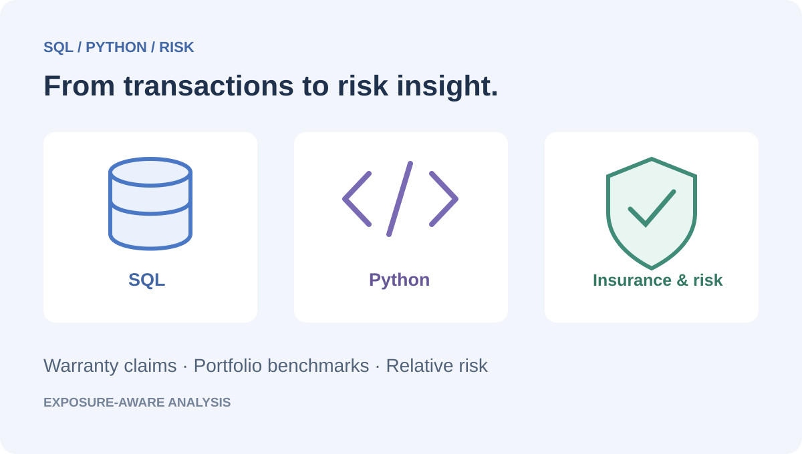
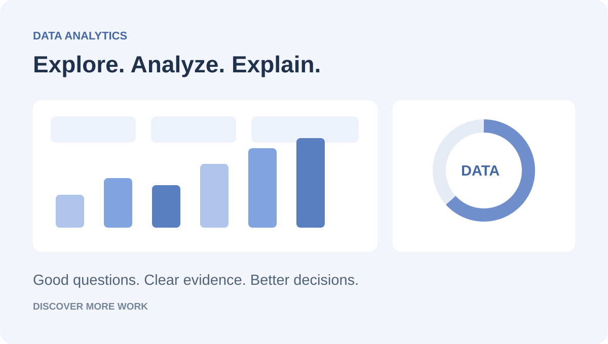

# Subachan Subedi 👋

**Data Analytics • Financial Analysis • Risk Modeling**  
Computer Science @ USF | Actuarial Science Minor

**Seeking Data Analyst / Actuarial Analyst Internships**

[Email](mailto:subachansubedi@gmail.com) &nbsp; / &nbsp; [LinkedIn](https://www.linkedin.com/in/subachan-subedi-624641331/) &nbsp; / &nbsp; [Projects](#selected-projects) &nbsp; / &nbsp; [About](#about) &nbsp; / &nbsp; [Toolkit](#toolkit)

I turn business questions into validated data, clear dashboards, and practical recommendations using SQL, Python, Power BI, and Excel.

## Selected projects

Five case studies across customer retention, operations, insurance, marketing, and retail. Open a preview for the full dashboard; follow the links for the implementation.

<table>
<tr>
<td width="50%" valign="top">
  
📦 &nbsp; 01 · OPERATIONS ANALYTICS

  <h3><a href="https://github.com/subachansubedi/Supply-Chain-And-Logistics-Analytics">Supply Chain &amp; Logistics</a></h3>
  
  
<strong>10 tables · 6 report pages</strong>

  
A six-page BI solution connecting inventory, procurement, logistics, and profitability across a synthetic supply chain.

  
 &nbsp;  &nbsp; 

  
<a href="https://github.com/subachansubedi/Supply-Chain-And-Logistics-Analytics"><strong>Case study ↗</strong></a> &nbsp; · &nbsp; <a href="https://github.com/subachansubedi/Supply-Chain-And-Logistics-Analytics/blob/main/Dashboard%20Pdf/Dashboard.pdf">Dashboard</a> &nbsp; · &nbsp; <a href="https://github.com/subachansubedi/Supply-Chain-And-Logistics-Analytics/blob/main/Sql%20File/validation_queries.sql">SQL validation</a>

</td>
<td width="50%" valign="top">
  
🛡️ &nbsp; 02 · RETAIL &amp; RISK ANALYTICS

  <h3><a href="https://github.com/subachansubedi/Consumer-Electronics-Retail-Sales-Warranty-Analytics">Retail Sales &amp; Warranty</a></h3>
  
  
<strong>1.04M transactions · 30,000 claims</strong>

  
Advanced SQL and Python analysis of sales performance, claim frequency, relative risk, product lifecycles, and adverse scenarios.

  
 &nbsp; 

  
<a href="https://github.com/subachansubedi/Consumer-Electronics-Retail-Sales-Warranty-Analytics"><strong>Case study ↗</strong></a> &nbsp; · &nbsp; <a href="https://github.com/subachansubedi/Consumer-Electronics-Retail-Sales-Warranty-Analytics/blob/main/sql/business_analysis.sql">SQL analysis</a> &nbsp; · &nbsp; <a href="https://github.com/subachansubedi/Consumer-Electronics-Retail-Sales-Warranty-Analytics/tree/main/actuarial-risk-analysis">Risk analysis</a>

</td>
</tr>
</table>

<table>
<tr>
<td width="50%" valign="top">
  
👥 &nbsp; 03 · CUSTOMER ANALYTICS

  <h3><a href="https://github.com/subachansubedi/customer-churn-retention-analytics">Customer Churn &amp; Retention</a></h3>
  
  
<strong>6,418 records · 2 report pages</strong>

  
SQL preparation, Power BI reporting, and a Python Random Forest workflow for customer retention.

  
 &nbsp;  &nbsp; 

  
<a href="https://github.com/subachansubedi/customer-churn-retention-analytics"><strong>Case study ↗</strong></a> &nbsp; · &nbsp; <a href="https://github.com/subachansubedi/customer-churn-retention-analytics/blob/main/Dashboard/CHURN_ANALYSIS_projectdashboard.pdf">Dashboard</a> &nbsp; · &nbsp; <a href="https://github.com/subachansubedi/customer-churn-retention-analytics/blob/main/Python/Churn_Prediction_Random_Forest.ipynb">Notebook</a>

</td>
<td width="50%" valign="top">
  
☂️ &nbsp; 04 · INSURANCE ANALYTICS

  <h3><a href="https://github.com/subachansubedi/insurance-portfolio-intelligence">Insurance Portfolio Intelligence</a></h3>
  
  
<strong>10,000 records · 7 source tables</strong>

  
Premium exposure, concentration, and data-quality analysis, supported by 20 SQL questions and 15 Python analyses.

  
 &nbsp;  &nbsp; 

  
<a href="https://github.com/subachansubedi/insurance-portfolio-intelligence"><strong>Case study ↗</strong></a> &nbsp; · &nbsp; <a href="https://github.com/subachansubedi/insurance-portfolio-intelligence/blob/main/Dashboard%20Pdf/insurance_dashboard.pdf">Dashboard</a> &nbsp; · &nbsp; <a href="https://github.com/subachansubedi/insurance-portfolio-intelligence/blob/main/Python/insurance_python_analysis.py">Python analysis</a>

</td>
</tr>
</table>

<table>
<tr>
<td width="50%" valign="top">
  
📣 &nbsp; 05 · MARKETING ANALYTICS

  <h3><a href="https://github.com/subachansubedi/Digital-Advertising-Performance-Analytics">Digital Advertising Performance</a></h3>
  
  
<strong>2 platforms · 15 analytical questions</strong>

  
Facebook and Instagram reporting across funnel, audience, creative format, timing, geography, and campaign budgets.

  
 &nbsp; 

  
<a href="https://github.com/subachansubedi/Digital-Advertising-Performance-Analytics"><strong>Case study ↗</strong></a> &nbsp; · &nbsp; <a href="https://github.com/subachansubedi/Digital-Advertising-Performance-Analytics/blob/main/Dashboard/dashboard.pdf">Dashboard</a> &nbsp; · &nbsp; <a href="https://github.com/subachansubedi/Digital-Advertising-Performance-Analytics/blob/main/python/digital_ad_python_analysis.py">Python analysis</a>

</td>
<td width="50%" valign="top">
  
🧭 &nbsp; CONTINUE EXPLORING

  <h3>Others ↗</h3>
  
  
More analytical questions, implementations, and project documentation.

  
<a href="https://github.com/subachansubedi?tab=repositories"><strong>Browse projects →</strong></a>

</td>
</tr>
</table>

Independent portfolio case studies using public or synthetic data. Metrics describe the project datasets, not client outcomes; brand names do not imply affiliation.

<strong>A closer look — selected findings &amp; technical depth</strong>

 

| Project | What the analysis shows | Implementation depth |
| :--- | :--- | :--- |
| **Supply chain** | **14 of 24** product–facility combinations below reorder point, alongside approximately **$1.11M excess inventory**. | Five fact tables, five dimensions, a six-page report, Python analysis, and independent SQL KPI reconciliation. |
| **Retail & warranty** | **2.88%** portfolio claim rate across 30,000 claims and 1.04M sales transactions. | CTEs, window functions, data validation, indexed schema, Python claim-frequency analysis, relative-risk scoring, and 10–30% claim-growth scenarios. |
| **Churn** | Month-to-month customers account for **88.3% of recorded churn**. | SQL Server/PostgreSQL preparation, 77,016 service rows, DAX measures, and a Random Forest notebook with training, evaluation, feature importance, and scoring code. |
| **Insurance** | **33.71%** of active modeled annual premium is concentrated in three states; **7,630 blank Region values** require review. | Seven CSV sources, reusable measures, 20 PostgreSQL questions, 15 Python analyses, and documented data-quality findings. |
| **Digital advertising** | Compares funnel and audience patterns across Facebook and Instagram. | Four source tables, two dashboard views, 15 Python questions, exported charts, and business reporting. |

## About

I'm a Computer Science student with an Actuarial Science minor, interested in the intersection of business intelligence, financial analysis, and risk. I enjoy the full analytical process: defining the question, checking the data, building a model, reconciling the numbers, and communicating what matters.

🎓 **University of South Florida** · B.S. Computer Science, Actuarial Science Minor  
Aug 2024 – May 2028 · **GPA: 3.93/4.0** · Dean's List, 4 semesters · USF Presidential Award

<strong>Earlier education &amp; academic distinction</strong>

 

**Global College · Kathmandu, Nepal**  
Cambridge International GCE AS & A Levels · Jul 2021 – Jun 2023  
GPA: 3.8/4.0 

## Toolkit

  
  
  
  
  

  
  
  
  
  

| Area | Tools & methods |
| :--- | :--- |
| **Query & analyze** | SQL · Python · pandas · NumPy · scikit-learn |
| **Model & validate** | PostgreSQL · SQL Server · MySQL · relational models · star schemas · ETL · data-quality checks |
| **Report & visualize** | Power BI · Excel · DAX · Power Query · Tableau |
| **Support decisions** | KPI reconciliation · financial & business analysis · segmentation · dashboards · business reporting |

## Let's connect

I'm seeking **Data Analyst / Actuarial Analyst Internships** focused on reporting, business intelligence, data quality, visualization, and decision support.

**[subachansubedi@gmail.com](mailto:subachansubedi@gmail.com)** &nbsp; · &nbsp; **[LinkedIn ↗](https://www.linkedin.com/in/subachan-subedi-624641331/)**

📍 Tampa, Florida

---

[Back to top ↑](#top)
